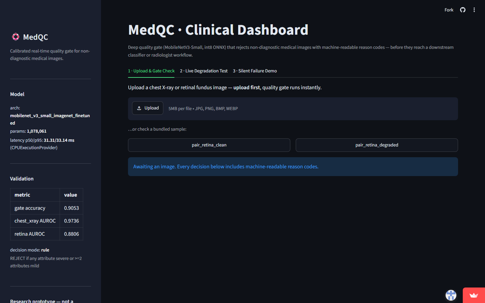

# MedQC — A Calibrated Real-Time Quality Gate for Rejecting Non-Diagnostic Medical Images

**Track 03 · Medical Imaging & Computer Vision (IEEE EMBS hackathon submission)**

[](https://github.com/joseph07-dev/medqc/actions/workflows/ci.yml)
[](https://github.com/joseph07-dev/medqc)
[](https://github.com/joseph07-dev/medqc)
[](https://github.com/joseph07-dev/medqc)

Downstream medical-imaging models fail *silently*: a blurred, over-exposed, rotated, or
occluded image still flows through the pipeline and produces a confident — and wrong —
prediction. Classical quality checks (Laplacian sharpness, clipped-pixel exposure) are too
weak to catch this: on our validation set they reach **F1 = 0.36 / 0.32** for severe
blur / exposure. MedQC is a learned, calibrated **accept/reject gate** that runs *before*
any clinical model and rejects non-diagnostic images with **machine-readable reason codes**.

---

## Problem alignment

| Requirement (problem statement) | How MedQC delivers |
|---|---|
| Detect non-diagnostic images in real time | int8 ONNX MobileNetV3-Small, **p50 31.3 ms / p95 33.1 ms** on CPU |
| Explain *why* an image was rejected | Reason codes: `BLUR_SEVERE`, `EXPOSURE_SEVERE`, `ROTATION_SEVERE`, `OCCLUSION_SEVERE`, `MULTI_MILD`, `GATE_THRESHOLD` |
| Calibrated confidence, not vibes | Temperature scaling + ECE reporting (**ECE 0.095**), decision mode/tau committed in `metrics.json` |
| Work across modalities | Chest X-ray (PneumoniaMNIST) **and** retinal fundus (RetinaMNIST), stratified metrics reported |
| Beat naive baselines | Classical baselines evaluated head-to-head (F1 0.36 / 0.32 vs gate AUROC 0.963) |

## How it works



```
image ──► degradation-aware preprocessing (224px, ImageNet norm)
      ──► MobileNetV3-Small backbone (1.08 M params, int8 quantised)
              ├── 4 × severity heads (BLUR / EXPOSURE / ROTATION / OCCLUSION, OK/MILD/SEVERE)
              └── 1 × gate head (p(reject), temperature-calibrated)
      ──► decision layer (mode + tau from metrics.json → val.decision)
              rule mode: REJECT if any attribute severe OR ≥2 attributes mild
              head mode:  REJECT if p(reject) ≥ tau
      ──► { decision, reasons[], severities, confidence, latency_ms }
```

Two decision modes are supported and selectable purely by configuration (no code change):

- **`rule`** — deterministic, auditable rule over predicted severities (default).
- **`head`** — calibrated probability thresholded at `tau`, with reason codes still derived
  from predicted severities (falls back to `GATE_THRESHOLD` if no severity is flagged).

## Results

Validation: 644 degraded images, 5 epochs, 5 788 training samples (Kaggle T4×2).

| Metric | Value |
|---|---|
| Gate accuracy | **0.9053** |
| Gate AUROC | **0.9634** |
| ECE (pre → post calibration) | 0.095 → 0.095 (T = 1.0) |
| Per-attribute accuracy (BLUR / EXPOSURE / ROTATION / OCCLUSION) | 0.992 / 0.713 / 0.933 / 0.983 |
| Latency p50 / p95 (CPU, int8 ONNX) | **31.3 / 33.1 ms** |
| Params | 1 078 061 |

**Stratified by modality** (the gate must generalize, not overfit one scanner):

| Modality | n | Gate accuracy | Gate AUROC |
|---|---|---|---|
| Chest X-ray | 524 | 0.924 | 0.974 |
| Retinal fundus | 120 | 0.825 | 0.881 |

**Learned vs classical** (severity detection):

| Target | Classical baseline F1 | Gate AUROC |
|---|---|---|
| Severe blur | 0.360 | 0.963 (overall) |
| Severe exposure | 0.318 | 0.963 (overall) |

Training curves, classical thresholds, stratified metrics and calibration are all committed
verbatim in [`metrics.json`](metrics.json).

## Repository layout

```
medqc/
├── app.py                     # Streamlit clinical dashboard (3 tabs)
├── src/medqc/
│   ├── degradations.py        # deterministic degradation synthesis (seed-controlled)
│   ├── gate.py                # decision logic + reason codes (rule / head modes)
│   ├── calibrate.py           # temperature scaling, ECE, reliability bins
│   ├── baseline.py            # classical Laplacian/exposure baselines
│   └── predict.py             # ONNX Runtime wrapper (GatePredictor / GateResult)
├── tests/                     # 61 tests across 7 suites
├── notebooks/train.ipynb      # full training + export notebook (Kaggle)
├── weights/                   # int8 + fp32 ONNX models
├── assets/samples/            # bundled demo images
├── .github/workflows/         # CI (lint+tests+coverage gate+secret scan)
├── metrics.json               # all reported numbers (single source of truth)
├── downstream_results.json    # silent-failure demo pairs
├── MODEL_CARD.md  SECURITY.md
└── requirements.txt  pyproject.toml  .streamlit/config.toml
```

## Quickstart

```bash
git clone <YOUR_REPO_URL> && cd medqc
python -m venv .venv && source .venv/bin/activate      # Windows: .venv\Scripts\activate
pip install -e ".[app,dev]"

streamlit run app.py        # clinical dashboard on http://localhost:8501
pytest                      # 61 tests, < 2 s
ruff check src tests app.py # lint
```

No API keys are required — inference is fully local (see `.env.example`).

## Deployment

- **Run locally:** `streamlit run app.py` serves the dashboard on `http://localhost:8501`
  (fully offline inference — no keys, no external services).
- **CI:** `.github/workflows/ci.yml` runs ruff + pytest (+90 % coverage gate) on Python
  3.11/3.12 and a gitleaks secret scan on every push.

## Testing

61 tests / 7 suites, all deterministic, **97 % line coverage** of `src/medqc`
(enforced in CI with `--cov-fail-under=90`):

- `test_degradations` — severity-0 exact no-op, byte-level seed determinism, sharpness drop,
  occlusion coverage, gate-label rule.
- `test_gate` — every branch of both decision modes, reason-code invariants
  (`accepted == (not reasons)`), tau boundary, invalid config errors.
- `test_calibrate` — sigmoid numerics, temperature scaling improves NLL on overconfident
  logits, ECE = 0 on perfectly calibrated data, reliability-bin bookkeeping.
- `test_baseline` — Laplacian/exposure score behaviour + thresholded verdicts.
- `test_predict` — ONNX session shapes, grayscale/numpy/PIL inputs, JSON-serialisable results.
- `test_metrics_config` — reported numbers within range, latency budget (p95 < 50 ms),
  demo-pair schema, **no plaintext credential patterns anywhere in the tree**.
- `test_e2e` — full image-in/decision-out invariants and interactive latency.

## Accessibility

- **Contrast:** dark theme with WCAG AA+ text/background contrast (light `#f8fafc` on `#0e1117`).
- **Keyboard:** every control (upload, sample buttons, sliders, tabs) is reachable and
  operable via `Tab`/`Enter` — Streamlit renders native ARIA-labelled widgets and tab lists.
- **Non-colour cues:** decisions carry text + symbols (`✔ ACCEPT` / `✖ REJECT`) and
  machine-readable reason-code chips, never colour alone; severity bars include text labels.
- **Responsive layout:** tested against a mobile viewport (`width=device-width`, fluid
  containers); images scale without horizontal scroll; 5 MB upload cap with clear errors.

## Security

See [SECURITY.md](SECURITY.md). In short: zero secrets in the repo (enforced by test +
gitleaks in CI), 5 MB upload cap, no upload persistence, reason codes drawn only from a
fixed enum, XSRF protection on, usage telemetry off.

## Limitations

- Training data is synthetic degradation on public MedMNIST subsets — a real deployment
  should fine-tune on site-specific acquisition artifacts.
- Exposure heads (acc 0.713) are the weakest attribute; more exposure diversity would help.
- Research prototype — **not a medical device**; decisions are advisory and require
  qualified clinical review.

## License

[MIT](LICENSE)
